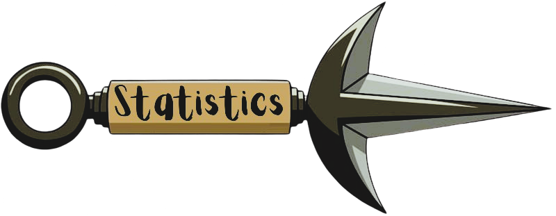

<!-- ===================================================== -->
<!-- Banner -->
<!-- ===================================================== -->

 

<!-- ===================================================== -->
<!-- GitHub Profile Badges -->
<!-- ===================================================== -->

  <!-- Stars -->
  

  <!-- Repositories -->

 <!-- Followers -->

  

<!-- ===================================================== -->
<!-- About Me -->
<!-- ===================================================== -->

<!--kuani about me-->

  

<!--about me section-->

  
> *"No single thing is perfect by itself. That's why we're born to attract other things to make up for what we lack."*
> **— Itachi Uchiha**

### 🚀 Building, Learning, Improving

Just like Itachi's wisdom, great software isn't built in isolation.

Like every great shinobi, every developer starts with limitations. Growth comes from learning, adapting, and continuously refining your craft.

My journey revolves around Software Development, Artificial Intelligence, and Cloud Technologies. Whether it's solving algorithmic challenges, building projects, or exploring emerging technologies, I enjoy turning ideas into practical solutions.

I thrive on collaboration, open-source contributions, and tackling complex problems through clean, efficient solutions.

* 🌐 **What I Build:** Projects driven by clean, modular, and reusable code.
* 🤝 **The Developer Way:** Always open to collaboration, hackathons, open-source contributions, and peer code reviews.
  

<!-- ===================================================== -->
<!-- Social Links -->
<!-- ===================================================== -->

  
  ### Let's Connect

  <!-- LinkedIn -->
  

  <!-- LeetCode -->
  

  <!-- Gmail -->
  
  

  

<!-- ===================================================== -->
<!-- Tech Stack -->
<!-- ===================================================== -->

  

<table align="center" cellpadding="28">
  <tr>
    <td align="center" width="140">
       
      Python
    </td>
    <td align="center" width="140">
       
      Java
    </td>
    <td align="center" width="140">
       
      C++
    </td>
  </tr>

  <tr>
    <td align="center" width="140">
       
      HTML
    </td>
    <td align="center" width="140">
       
      CSS
    </td>
    <td align="center" width="140">
       
      MySQL
    </td>
  </tr>

  <tr>
    <td align="center" width="140">
       
      AWS
    </td>
    <td align="center" width="140">
       
      GitHub
    </td>
    <td align="center" width="140">
       
      Git
    </td>
  </tr>
</table>

 

<!-- ===================================================== -->
<!-- Contribution Graph -->
<!-- ===================================================== -->

  

<!-- ===================================================== -->
<!-- GitHub Statistics -->
<!-- ===================================================== -->

